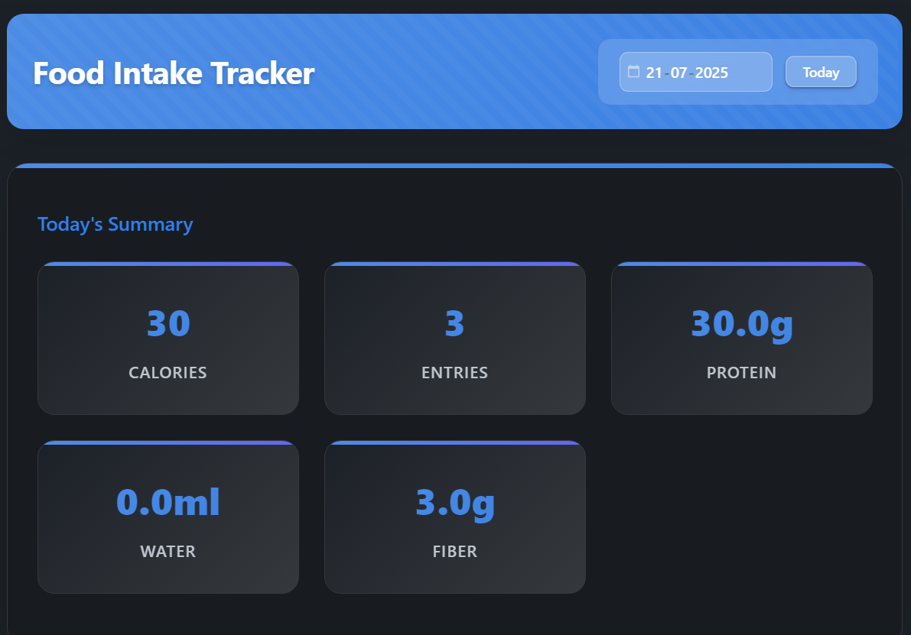
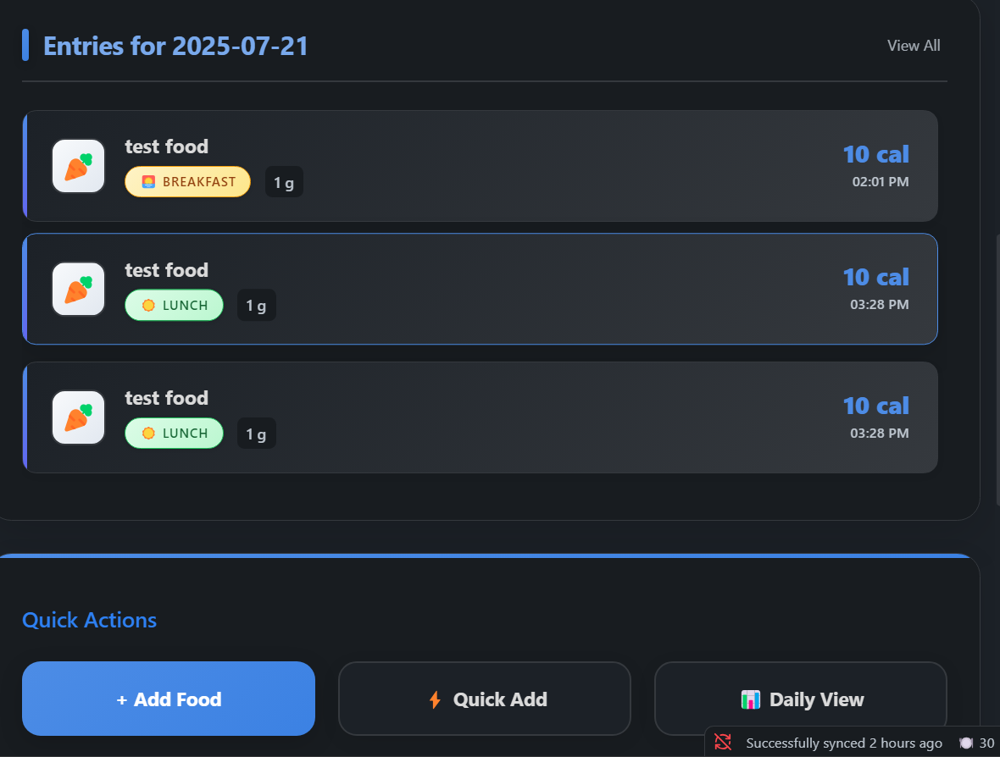

# 🏁 Usage Guide

## Quick Start

1. Click the 🍽️ icon in your left ribbon (or press the keyboard shortcut).
2. Today's food dashboard appears!

## Main Dashboard

| Area         | What it shows                                                |
|--------------|-------------------------------------------------------------|
| **Header**   | Date picker/calendar, quick navigation arrows               |
| **Stats**    | Calories, macros, water, entries; updates in real-time      |
| **Entries**  | Recent meals with icons, time, macro breakdown, edit/delete |
| **Goals**    | Progress bars and recommendations, based on your targets    |
| **Actions**  | Add food , jump to calendar or weekly stats 		         |

---

## Logging a Meal or Drink

1. Press **Add Food Entry**
2. Enter details: search food, set quantity, select meal (breakfast/lunch/etc).
3. **Save** – the dashboard colorizes & updates!

---

## Deleting Entries

- Click the  **Delete** icon next to any entry.

---

## Calendar & Weekly Views

- **Calendar:** Dots visualize days with entries, darker dot = more calories.
- **Weekly Trend:** Color bars, average stats, recommendations, and fun badges.

---

## Tips

- Use command palette: `Cmd/Ctrl+P` → “Food Intake Tracker: …” to jump directly to any view or action.

- Export daily/weekly summaries to Markdown for journaling.
- Fully responsive: works on mobile and desktop!
